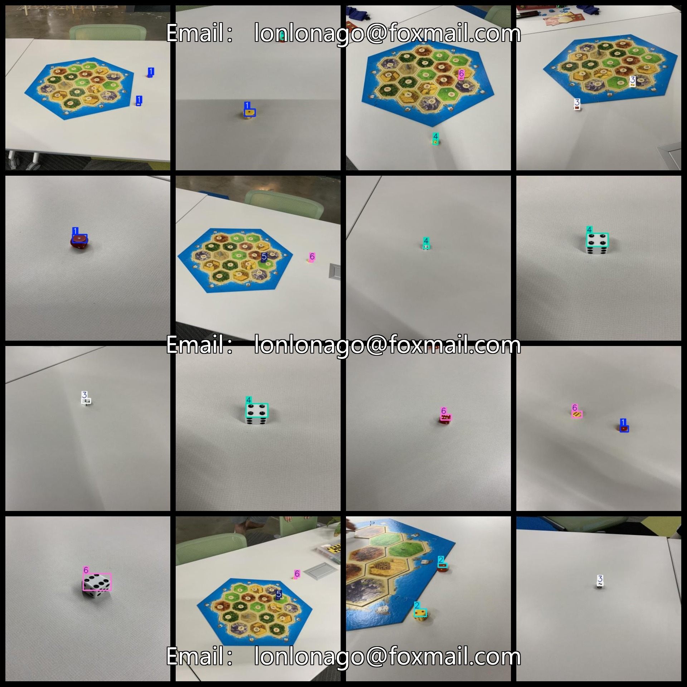

# Dice Points Recognition Dataset 718 imagesVOC+YOLO format

Dice Point Recognition Dataset 718 sheets VOC + YOLO format

Dataset Format: VOC format + YOLO format

The compressed file contains: three folders, each storing images, xml files, and text files.

Total jpg images in JPEGImages folder: 718

The total number of XML files in the Annotations folder is 718.

The total number of txt files in the labels folder is 718.

Number of tag types: 6

Tag names: ["1","2","3","4","5","6"]

The number of boxes for each label (Note that the order of labels in the Yolo format does not correspond to this, but is based on the classes.txt file in the labels folder):

1 frame count = 290

2 frame count = 274

3 frame count = 390

4 frame count = 364

5 frame count = 190

6 frame count = 426

Total boxes: 1934

Picture clarity (Resolution: Pixels): Clear

Is the image enhanced: No

Shape of the label: Rectangular box, used for object detection and recognition.

Important Note: None

Special Notice: This dataset does not guarantee the accuracy or precision of the trained models or weight files. The dataset only provides accurate and reasonable annotations.

Annotation and image details are as follows:

## Images

---

Here is a pay link on Stripe (https://buy.stripe.com/3cs8yP7sY87d0vu9AB). Please contact me lonlonago@foxmail.com after funding $89, and I will send you a complete data files, thank you!

